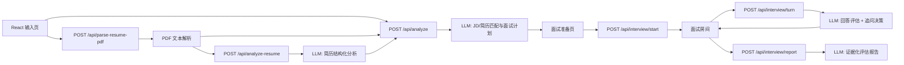
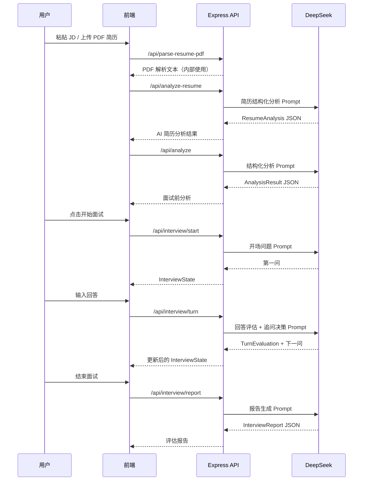

# 智能招聘面试官 MVP

一个真实 LLM 驱动的智能招聘面试官 Demo。用户粘贴 1 份 JD，上传 1 份 PDF 简历，系统先解析 PDF，再由大模型生成简历分析结果和面试前分析，之后由 AI 模拟专业技术面试官进行多轮文字面试。面试官会根据候选人回答动态追问，最后输出基于问答证据的结构化评估报告。

## 环境配置

要求：

- Node.js 20+
- npm
- DeepSeek API Key

创建本地环境变量文件：

```bash
cp .env.example .env.local
```

填写：

```bash
DEEPSEEK_API_KEY=你的 DeepSeek API Key
DEEPSEEK_BASE_URL=https://api.deepseek.com
DEEPSEEK_MODEL=deepseek-v4-flash
```

如果没有配置 `DEEPSEEK_API_KEY`，系统不会使用假数据兜底；后端会返回明确配置错误。

项目也保留了 OpenAI-compatible 的备用配置。如果你之后要切回 OpenAI，可以改用 `OPENAI_API_KEY` 和 `OPENAI_MODEL`。

## 启动步骤

```bash
npm install
npm run dev
```

默认地址：

- 前端：http://127.0.0.1:5173
- 后端：http://127.0.0.1:8787

构建检查：

```bash
npm run build
```

## 核心功能

- 粘贴 JD，并上传一份 PDF 简历
- 自动解析 PDF 简历文本，并调用大模型生成候选人画像、核心技能、关键项目和风险追问点
- 前端只展示 AI 简历分析结果，不展示 PDF 解析原文
- 调用大模型生成岗位摘要、候选人摘要、匹配初判、风险点和面试计划
- 点击开始面试后进入文字面试房间
- AI 面试官根据候选人上一轮回答动态追问
- 实时展示当前阶段、考察能力、证据充分度、待验证风险
- 手动结束面试并生成结构化评估报告

## 核心架构设计



模块划分：

- `client/`：Vite + React + TypeScript 前端
- `server/`：Express API、DeepSeek/OpenAI-compatible 调用、Prompt 编排
- `shared/`：Zod schema 和 TypeScript 类型，前后端共享

## 数据流向



## Prompt 设计思路

系统拆成 5 类 Prompt，而不是一个大 Prompt 从头跑到底：

1. **简历结构化分析 Prompt**
   - 输入 PDF 解析出的简历文本。
   - 输出 `ResumeAnalysis`，包含候选人摘要、核心技能、关键项目、优势、模糊表述、风险点和建议追问方向。
   - 前端只展示这份 AI 分析结果，不展示 PDF 解析原文。

2. **JD / 简历匹配分析 Prompt**
   - 输入 JD 文本、PDF 解析出的简历文本，以及已完成的 `ResumeAnalysis`。
   - 提取岗位职责、必备能力、候选人项目、技能、模糊表述、风险点。
   - 输出 `AnalysisResult`，用于面试前简报和后续 Agent 上下文。

3. **开场问题 Prompt**
   - 根据分析结果生成第一句面试问题。
   - 第一问优先从候选人关键项目切入，要求说明背景、个人职责、技术选择和结果。

4. **面试轮次 Prompt**
   - 输入当前 `InterviewState` 和候选人最新回答。
   - 先生成 `TurnEvaluation`，再决定下一步是追问、深挖、质疑、切换能力点，还是提示可结束。
   - 硬性要求：回答空泛必须追具体事实；缺数据必须追指标口径；职责不清必须追个人贡献；与简历矛盾必须直接指出。

5. **报告生成 Prompt**
   - 根据完整问答状态输出 `InterviewReport`。
   - 每个风险必须绑定具体问答证据，避免“感觉不匹配”这种空泛判断。

所有 LLM 输出都会经过 Zod schema 校验。模型返回非 JSON 或字段缺失时，后端返回可解释错误，不把脏数据传给前端。

## 难点与解决方案

- **难点：面试不能像固定题库。**
  - 解决：使用 `InterviewState` 保存当前阶段、考察能力、待验证风险、已收集证据和历史问答；每轮回答后先评估，再决定下一问。

- **难点：AI 容易泛泛追问。**
  - 解决：Prompt 中写死追问规则：模糊就追细节，没有数据就追指标，职责不清就追个人贡献，矛盾就直接质疑。

- **难点：最终报告容易没有证据。**
  - 解决：报告 Prompt 要求 `risks` 和 `qaEvidence` 引用面试过程；报告 schema 强制输出证据字段。

- **难点：没有数据库但要支持多轮状态。**
  - 解决：首版保持无状态服务端，前端每轮把完整 `InterviewState` 带回后端。这样本地 Demo 简单，且不保存候选人数据。

## API 设计

- `POST /api/analyze`
  - input: `{ jdText: string, resumeText: string, resumeAnalysis?: ResumeAnalysis }`
  - output: `AnalysisResult`

- `POST /api/parse-resume-pdf`
  - input: `multipart/form-data`，字段名 `resumePdf`
  - output: `{ fileName: string, text: string, charCount: number, pageCount: number | null }`
  - 说明：`text` 是内部输入材料，前端不展示解析原文。

- `POST /api/analyze-resume`
  - input: `{ resumeText: string }`
  - output: `ResumeAnalysis`

- `POST /api/interview/start`
  - input: `{ analysis: AnalysisResult }`
  - output: `{ sessionId: string, firstQuestion: InterviewMessage, state: InterviewState }`

- `POST /api/interview/turn`
  - input: `{ sessionId: string, answer: string, state: InterviewState }`
  - output: `{ interviewerMessage: InterviewMessage, turnEvaluation: TurnEvaluation, state: InterviewState, canFinish: boolean }`

- `POST /api/interview/report`
  - input: `{ analysis: AnalysisResult, state: InterviewState }`
  - output: `InterviewReport`

## 演示视频脚本

建议录制 2 分 30 秒左右：

1. **0:00-0:20**：说明场景。招聘同学拿到技术岗 JD 和一份简历，需要快速完成一次结构化初面。
2. **0:20-0:45**：打开系统，粘贴 JD，上传 PDF 简历，确认左侧出现 AI 简历分析结果，点击“开始分析”。
3. **0:45-1:10**：展示分析进度和面试官简报，包括匹配初判、风险点、面试结构。
4. **1:10-1:30**：点击“开始面试”，AI 从候选人关键项目切入。
5. **1:30-2:05**：候选人回答一个模糊答案，例如“做过性能优化，速度快了不少”。展示 AI 追问指标口径、个人贡献和具体方案。
6. **2:05-2:25**：再回答一轮，展示 AI 根据回答继续深挖或切换能力点。
7. **2:25-2:45**：点击结束面试，展示报告里的综合结论、主要风险和问答证据摘要。

## 当前范围

首版刻意不做：

- JD 文件上传
- 扫描件 / 图片版 PDF OCR
- 数据库存储
- 登录权限
- 多岗位管理
- 候选人长期管理
- 面试历史记录
- 语音面试
- Mock AI 输出

这个 MVP 的判断标准不是功能多，而是能否让招聘同学真实体验到：AI 面试官会基于 JD、简历和候选人回答进行有证据链的动态追问。
